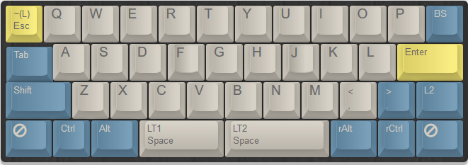
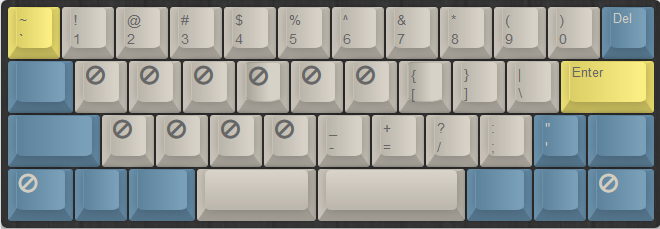
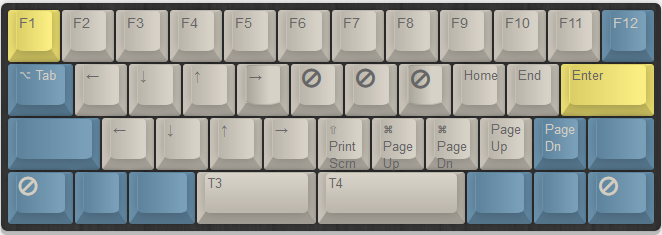
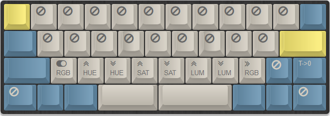
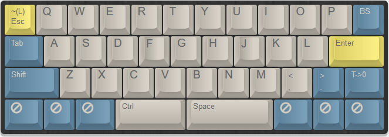

# Daisy

By default the Daisy keyboard comes with a [LUFA HID bootloader](https://github.com/tmk/tmk_core/tree/master/protocol/lufa/LUFA-git/Bootloaders/HID) and a [TMK firmware](https://github.com/kairyu/tmk_keyboard_custom/tree/master/keyboard/daisy).
It can be tweaked on the [YD Keymap Builder](http://ydkb.io/) website and burnt with `hid_bootloader_cli`.

## Lufa HID Bootloader

To launch the bootloader, plug the daisy keyboard while pressing `ESC`.

You should see a device with a VID of `1209` and a PID of `2327` (rev 0.4 PCB) with `lsusb`:

```
HID\VID_1209&PID_2327\7&14E4C529&0&0000
```

## Compile Firmware

Both firmwares are tested successfully on my Daisy PCB rev 0.4.

-  TMK
TMK support can be found [here](https://github.com/kairyu/tmk_keyboard_custom/tree/master/keyboard/daisy)

-  QMK
QMK support can be found [here](https://github.com/qmk/qmk_firmware/tree/master/keyboards/daisy)

## Burn Firmware

The firmware can be burnt with the LUFA `hid_bootloader_cli` and also the [Teensy loader CLI](https://www.pjrc.com/teensy/loader_cli.html) (/!\ to be tested)

```shell
hid_bootloader_cli[.exe] -v -mmcu=atmega32u4 -f daisy-keymap.hex
```

The source of the `hid_bootloader_cli` can be found in the [LUFA repository](https://github.com/tmk/tmk_core/blob/master/protocol/lufa/LUFA-git/Bootloaders/HID/HostLoaderApp/hid_bootloader_cli.c)

## Layout

> Layer 0: classic alpha



> Layer 1: numbers and punctuation



> Layer 2: functions and movements



> Layer 3: RGB



> Layer 4: gaming :)


