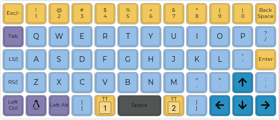
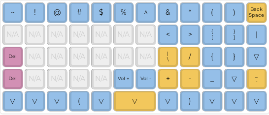
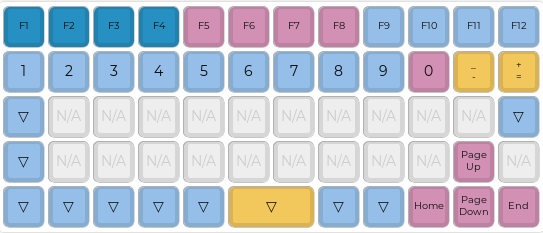
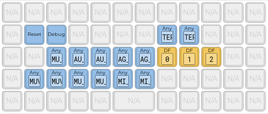

# Preonic

## Compile Firmware

-  QMK
QMK support can be found [here](https://github.com/qmk/qmk_firmware/tree/master/keyboards/preonic)

## Burn Firmware

```shell
$ dfu-tool list
$ dfu-util -v -d 0483:df11 -a 0 -s 0x08000000:leave -D preonic_rev3_grumpycat.bin
```

## Layout

> Layer 0: classic alpha



> Layer 1: punctuation



> Layer 2: functions and numbers



> Layer 3: Misc


