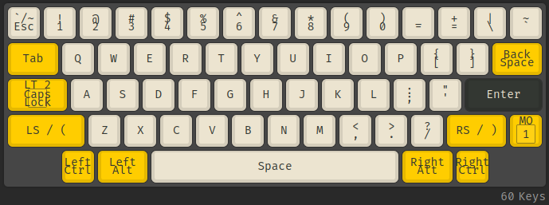
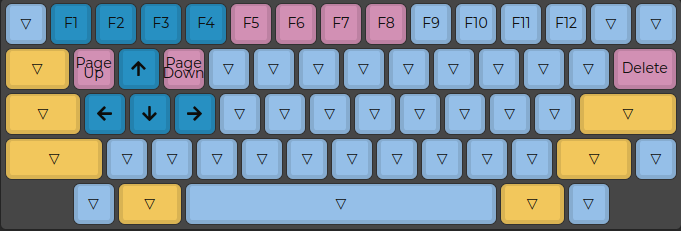

# Tokyo60

## Compile Firmware

- QMK
QMK support can be found [here](https://github.com/qmk/qmk_firmware/tree/master/keyboards/tokyokeyboard/tokyo60)

## Burn Firmware

```shell
Bus 003 Device 004: ID 03eb:2ff4 Atmel Corp. atmega32u4 DFU bootloader

sudo dfu-programmer atmega32u4 get product-name
Product Name: 0x95 (149)

sudo dfu-programmer atmega32u4 get bootloader-version
Bootloader Version: 0x00 (0)
```

## Layout

> Layer 0: classic alpha



> Layer 1: function


