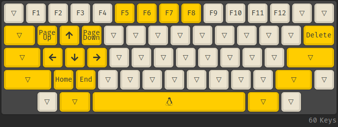
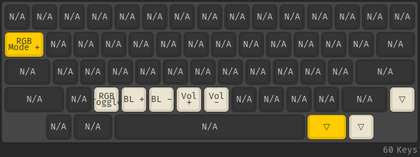

# Tokyo60

## Compile Firmware

QMK support can be found [here](https://github.com/qmk/qmk_firmware/tree/master/keyboards/tokyokeyboard/tokyo60)

## Burn Firmware

```shell
Bus 003 Device 004: ID 03eb:2ff4 Atmel Corp. atmega32u4 DFU bootloader

sudo dfu-programmer atmega32u4 get product-name
Product Name: 0x95 (149)

sudo dfu-programmer atmega32u4 get bootloader-version
Bootloader Version: 0x00 (0)

sudo dfu-programmer atmega32u4 erase --debug=999
dfu.c:144: dfu_download( 0x7ffc2fb812a0, 6, 0x7ffc2fb811d2 )
dfu.c:165: Message: m[0] = 0x03
dfu.c:165: Message: m[1] = 0x01
dfu.c:165: Message: m[2] = 0x00
dfu.c:165: Message: m[3] = 0x00
dfu.c:165: Message: m[4] = 0x6f
dfu.c:165: Message: m[5] = 0xff
dfu.c:203: dfu_get_status( 0x7ffc2fb812a0, 0x7ffc2fb811c4 )
dfu.c:229: ==============================
dfu.c:230: status->bStatus: OK (0x00)
dfu.c:232: status->bwPollTimeout: 0x0001 ms
dfu.c:233: status->bState: dfuIDLE (0x02)
dfu.c:235: status->iString: 0x00
dfu.c:236: ------------------------------
atmel.c:784: Flash region from 0x0 to 0x6FFF is blank.
atmel.c:861: Flash blank from 0x0 to 0x6FFF.
Empty.

sudo dfu-programmer atmega32u4 flash --debug=999 tokyokeyboard_tokyo60_grumpycat.hex
dfu.c:144: dfu_download( 0x7ffc2cda6c00, 6, 0x7ffc2cda69f2 )
dfu.c:165: Message: m[0] = 0x03
dfu.c:165: Message: m[1] = 0x00
dfu.c:165: Message: m[2] = 0x6c
dfu.c:165: Message: m[3] = 0x00
dfu.c:165: Message: m[4] = 0x6f
dfu.c:165: Message: m[5] = 0xff
dfu.c:179: dfu_upload( 0x7ffc2cda6c00, 1024, 0x55df17906080 )
Success
intel_hex.c:626: Validating image from byte 0x0 to 0x6FFF.
Validating...  Success
0x5380 bytes written into 0x7000 bytes memory (74.55%).

sudo dfu-programmer atmega32u4 reset
```

## Layout

> Layer 0: classic alpha


> Layer 1: function



> Layer 2: configuration


